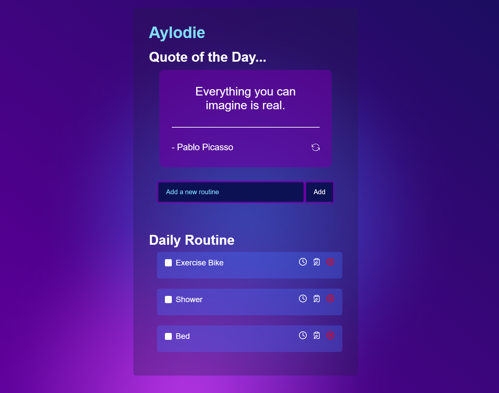
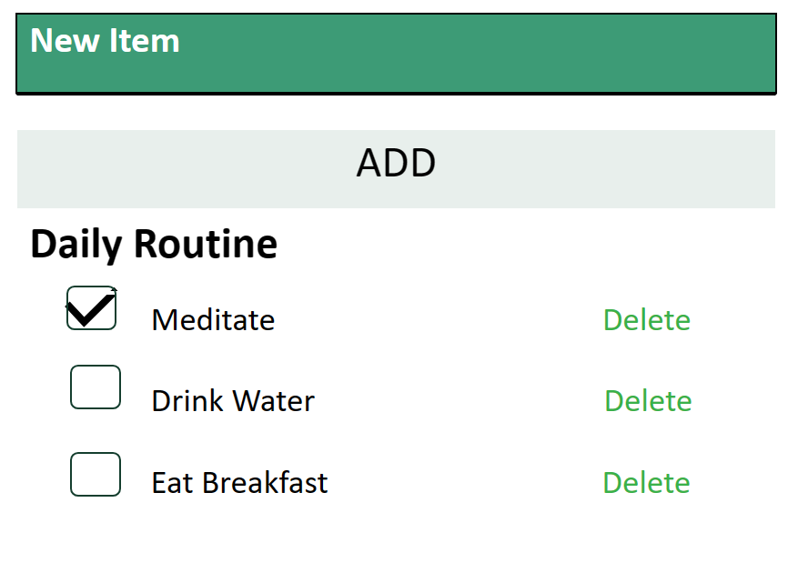

# Aylodie - React App to Track Daily Routines​

> Full Stack JavaScript Assessment

Aylodie can be found here: https://aylodie.netlify.app/

## 🚩 Table of Contents

- [Why Aylodie Daily Routines App?](#-why-aylodie-daily-routines-app)
- [Easy Routine App UI](#-easy-routine-app-ui)
- [How the App Works](#-how-the-app-works)
- [App Design](#-app-design)
- [Future Features](#-future-features)
- [Browsers](#-browsers)
- [Thanks](#-thanks)

## 🤖 Why Aylodie Daily Routines App?

I wanted to create an app that doesn't just have the ability to create activities, list them, edit them, mark them as completed or delete them. this app also allows you to set a length of time that you want to take to complete each activity, and makes sure that you have a break afterwards. Inspirational quotes provide extra daily motivation.  I also wanted an app that is colourful and beautiful to look at.

## 🚀 Easy Routine App UI

Aylodie has a very easy to use user interface.

* **Quote of the Day** : Get your inspirational quote by clicking on the reload icon in the quote box, and if the quote you get is not what you would like, you can click reload to get a different quote.
* **Adding and Editing** : New routines are added easily using the form in the centre of the app. Once added the routine can be edited or deleted using the icons on the right of the entry.
* **Timer** : A third icon to the right of a routine entry takes you to a timer, which is set to defaults of 10 minutes activity with a 5 minute break.  The settings icon takes you to a screen where you can alter the number of minutes for the activity and the break.

## 🔧 How the App Works

* **Quote API** : The quotes are suppied via an API connection to [quotable](https://github.com/lukePeavey/quotable) which provides 10 random quotes from their database. Error handling is implemented, in case of a broken connection 
* **Add and Edit Form Components** : The form components for adding and editing use handle submit functions to handle the data.
* **Timer Component** : The timer component incorporates two installed applications -  [react progress bar](https://github.com/kevinsqi/react-circular-progressbar), for the main timer functionality, and [react slider](https://github.com/zillow/react-slider) for the settings area.
* **Backend** : Currently using local storage, but further backend functionality will use MongoDB to store data from the routine entries. An attempt was made to retrospectively set the application up as a MERN stack.

## 📜 App Design

The diagram shown below was the starting point for my design, with features which allowed for adding new items, the ability to check off items and delete them. I considered the apps that I have enjoyed using, and I wanted to incorporate quotes and a timer, which currently don't exist together in one app.

## 🎨 Future Features

Future features could include:

* Themes: Users could choose from a variety of different themes
* Saving Settings: Saving of changes to activity and break minutes 
* Duration: Adding up the time taken to complete the full routine

## 💬 User Feedback

Users mentioned that a feature where the activity and break ran continuously would be good, and that different light and dark themes would be welcome.

## 🌏 Browsers

Aylodie will work in the following browsers:

  Chrome    Internet Explorer    Edge    Safari    Firefox 

## 🍞 Thanks

Thanks to all the staff at Coding Black Females, and everyone in the Williams cohort for your support :) 

